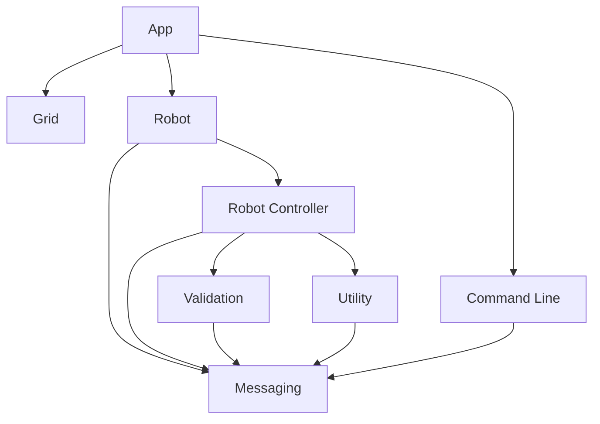

#Design Direction

## The platform
The node platform was used for this project. As I'm not great at 
building command line interfaces I thought it best to use a language that I know, Javascript.

## The process
Before beginning coding I wrote down the modules and general control flow of the project.



## Coding
### App
The App builds out the grid and the robot and then the command line waits for the commands. The app will take a different size grid, you can change that in the config.json

### Grid
The Grid knows how to be created. And it will return the current grid size in an array of [x,y]. The Grid is built as a singleton as there only needs to be one in the application.

### Robot
The robot is the workhorse of the project. The robot is built as a singleton as there is only need for one robot in the application. The robot has also been built using the observer model and receives messages from the command line to act upon.

The robot responds to the following commands: Place, Move, Left, Right, Report.
In order to decouple the application from the commands. They exist in a seperate file for updating or changing the type of validation involved.

This is an example from the command file.
```{
command:  'PLACE',
help:  "Place will put the robot onto the board. If the location 
and direction given to the place command are not valid the command
will be ignored. The robot can be picked up and placed at any time.",
validation: ['isFacingValueValid', 'isPositionValid'],
action:  'placeRobot'
} 
```

The robot knows how to operate on the action and the validation array is the types of validation necessary for the command to be valid. The robot will return a snarky comment if it is unable to action the command given.

The robot file should be abstracted a bit more, it is too big but that is an exercise for later.

### Messaging
The messaging file is also a singleton and an event listener as there is no need for multiple ones on the project. The messages sent to the listener are broadcast to the command line using a typewriter plugin to give the project a bit of flair. 
There are also multiple colours used based on the message to be broadcast.
Error messages are white with a red background for example.

### Validation
The validation is pretty simple and checks the validity of the command it is given.
Most of the validation is around the Place command as it has a number of different things that could go wrong.

Place command things that could go wrong:
1) Invalid X location
2) Invalid Y location
3) Invalid Direction

If at any point the command or validation needs to be update. This is more easily done as it is decoupled.

### Testing
The project has been tested using Jest. This is one area where I know I could use more work. Testing a website is one thing but a command line interface is a completely different beast. One that i've never done before I tried it here.
Actually writing a command line interface i've never done before either.

There are a lot of test, however, most of them fail and this is because using a pub/sub system for the Robot Controller. Im sure once i've seen how to test it properly i'd be okay in doing it again.

#### Breakdown
Grid: The grid has one test file which test the size of the grid and the output from a grid declaration. 

Robot: The robot has two test files. One a input test which was previously given in the challenge the other unit tests around all of the commands.

Should there be tests for the validation. Absolutely are they missing. Yep. I will continue to work on this solution until I think it is in an even better space with code coverage and other types of testing as well.